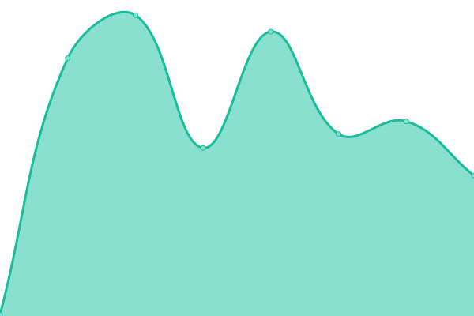

# [📈 Live Status](https://demo.upptime.js.org): <!--live status--> **🟧 Partial outage**

This repository contains the open-source uptime monitor and status page for [Upptime](https://upptime.js.org), powered by [Upptime](https://github.com/upptime/upptime).

With [Upptime](https://upptime.js.org), you can get your own unlimited and free uptime monitor and status page, powered entirely by a GitHub repository. We use [Issues](https://github.com/upptime/upptime/issues) as incident reports, [Actions](https://github.com/upptime/upptime/actions) as uptime monitors, and [Pages](https://demo.upptime.js.org) for the status page.

<!--start: status pages-->
<!-- This summary is generated by Upptime (https://github.com/upptime/upptime) -->
<!-- Do not edit this manually, your changes will be overwritten -->
<!-- prettier-ignore -->
| URL | Status | History | Response Time | Uptime |
| --- | ------ | ------- | ------------- | ------ |
|  [Google](https://www.google.com) | 🟩 Up | [google.yml](https://github.com/lvzhip/upptime/commits/HEAD/history/google.yml) | 

 82ms
     
 | 

<a href="https://demo.upptime.js.org/history/google">100.00%</a>
    

|  [Wikipedia](https://en.wikipedia.org) | 🟩 Up | [wikipedia.yml](https://github.com/lvzhip/upptime/commits/HEAD/history/wikipedia.yml) | 

 213ms
     
 | 

<a href="https://demo.upptime.js.org/history/wikipedia">100.00%</a>
    

|  [Online Chat](https://example.koj.co) | 🟥 Down | [online-chat.yml](https://github.com/lvzhip/upptime/commits/HEAD/history/online-chat.yml) | 

 94ms
     
 | 

<a href="https://demo.upptime.js.org/history/online-chat">0.00%</a>
    

|  [ping ip](165.84.188.86) | 🟥 Down | [ping-ip.yml](https://github.com/lvzhip/upptime/commits/HEAD/history/ping-ip.yml) | 

 0ms
     
 | 

<a href="https://demo.upptime.js.org/history/ping-ip">0.00%</a>
    

|  [port 9443](165.84.188.81) | 🟩 Up | [port-9443.yml](https://github.com/lvzhip/upptime/commits/HEAD/history/port-9443.yml) | 

 188ms
     
 | 

<a href="https://demo.upptime.js.org/history/port-9443">100.00%</a>
    

|  [alarm](165.84.188.86) | 🟥 Down | [alarm.yml](https://github.com/lvzhip/upptime/commits/HEAD/history/alarm.yml) | 

 0ms
     
 | 

<a href="https://demo.upptime.js.org/history/alarm">0.00%</a>
    

|  [ping port](165.84.188.81) | 🟩 Up | [ping-port.yml](https://github.com/lvzhip/upptime/commits/HEAD/history/ping-port.yml) | 

 191ms
     
 | 

<a href="https://demo.upptime.js.org/history/ping-port">100.00%</a>
    

|  [Self-signed SSL](https://165.84.188.81:19005/login) | 🟩 Up | [self-signed-ssl.yml](https://github.com/lvzhip/upptime/commits/HEAD/history/self-signed-ssl.yml) | 

 955ms
     
 | 

<a href="https://demo.upptime.js.org/history/self-signed-ssl">100.00%</a>
    

|  [Login API](https://uptimerobot.com/login) | 🟥 Down | [login-api.yml](https://github.com/lvzhip/upptime/commits/HEAD/history/login-api.yml) | 

 860ms
     
 | 

<a href="https://demo.upptime.js.org/history/login-api">98.49%</a>
    

<!--end: status pages-->

[**Visit our status website →**](https://demo.upptime.js.org)

## 📄 License

- Powered by: [Upptime](https://github.com/upptime/upptime)
- Code: [MIT](./LICENSE) © [Upptime](https://upptime.js.org)
- Data in the `./history` directory: [Open Database License](https://opendatacommons.org/licenses/odbl/1-0/)
